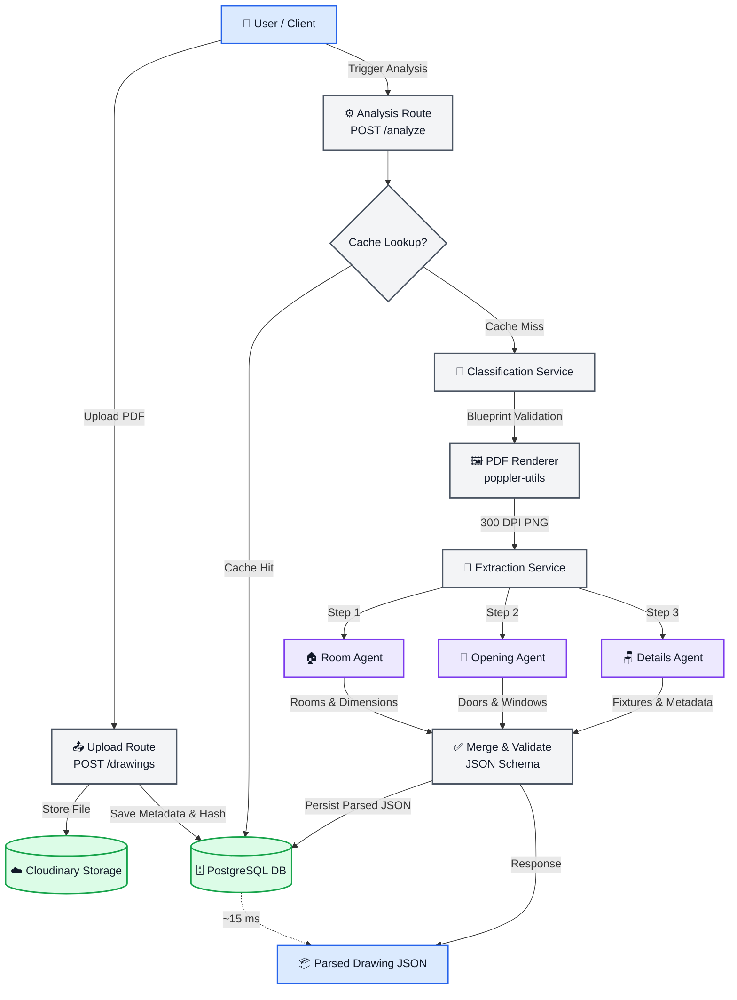

# BuildOps Constructability Platform

BuildOps is a high-performance constructability review platform that automates blueprint parsing, space classification, and cross-discipline conflict detection. Powered by Gemini Multimodal models and a multi-agent orchestration architecture, it helps engineering teams discover design issues before they reach the field.

---

## 🏗️ Architecture & Blueprint Analysis Flow

The following diagram illustrates the lifecycle of a drawing from PDF upload to multi-agent coordinate extraction, caching, and client review:



---

## 🚀 Key Features

- **Multi-Agent Drawing Analysis:** Parallelized classification, extraction, and validation of blueprint components using dedicated specialized LLM agents (Room, Opening, Details).
- **Interactive CAD Floor Plan Viewer:** Rich vector graphic overlay mapping and highlighting identified conflicts (spatial, semantic, discipline-specific) in real-time.
- **Automated RFI Draft Generation:** Instantly builds structured Requests for Information (RFIs) containing description, technical questions, and suggestions.
- **Secure File Storage:** Automatic Cloudinary integration with local mock fallbacks for isolated sandbox environments.
- **Monorepo Structure:** High-efficiency build cache pipeline using Turborepo.

---

## 🛠️ Technology Stack

- **Monorepo Tooling:** Turborepo
- **Client (Frontend):** React, TypeScript, Vite
- **Server (Backend):** Node.js, Express, TypeScript, Prisma (PostgreSQL)
- **Database:** PostgreSQL
- **Orchestration / LLM:** Google Gemini Flash Lite

---

## 💻 Development Setup

### Prerequisites
- Node.js (v24+)
- npm
- Docker & Docker Compose

### 1. Initialize PostgreSQL Database
Spin up the local PostgreSQL container:
```bash
docker compose up -d
```

### 2. Install Project Dependencies
Run install in the monorepo root:
```bash
npm install
```

### 3. Generate Database Client & Seed Data
Apply Prisma migrations and seed the initial BuildOps demo data:
```bash
# Apply migrations
npx prisma migrate dev --schema=apps/server/prisma/schema.prisma

# Seed database
npm run seed --prefix apps/server
```

### 4. Start Development Servers
Boot both the frontend client and backend server concurrently:
```bash
npm run dev
```
